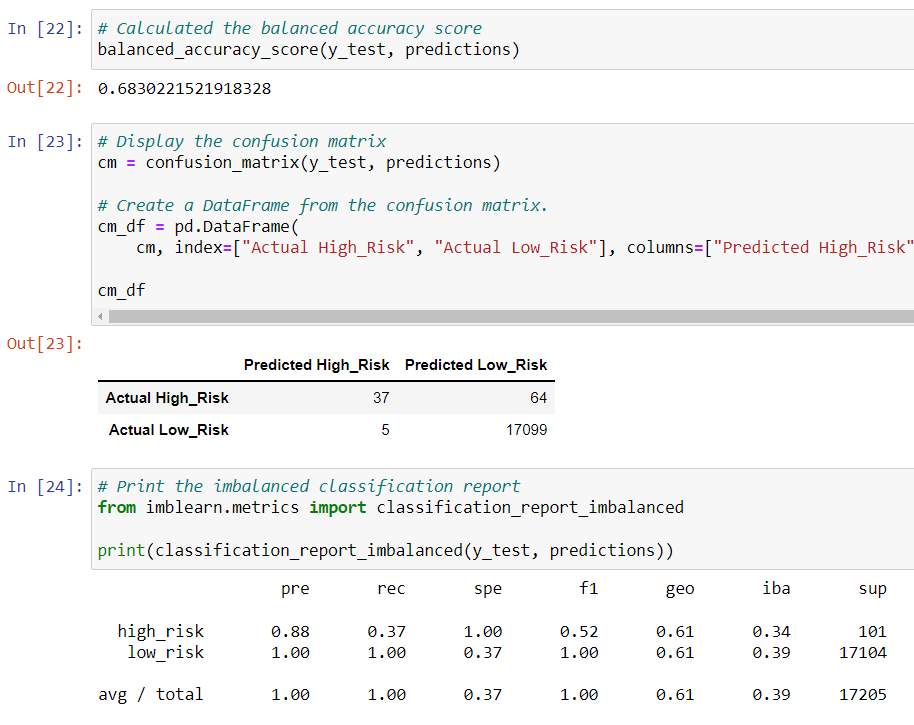

# Credit_Risk_Analysis

## Overview of the loan prediction risk analysis
The purpose of this challenge is to apply machine learning to solve a real-world challenge in assessing credit card risk. Using different techniques in machine learning to train and evaluate the models will help assess the risk levels based on the given data. The different techniques that will be used are random oversampling, SMOTE, random undersampling, a combination of oversampling & undersampling, random forest, and adaboost. Each of the models provide statistical outcomes for company Lending Club to assess.

## Results
Upon running the different models in machine learning, we will compare the balanced accuracy scores. The reason for this is because the balanced accuracy score provides users with the best performance estimate for inflated data. Our initial dataset has a count of 68,470 for low-risk and 347 for high-risk. 

|Models| Random Oversampling | SMOTE | Random Undersampling | Combination Sampling | Random Forest | AdaBoost |
|:---: | :---: |:---:|:---:|:---:|:---:|:---:|
| | 0.6620 | 0.6568 | 0.5443 | 0.6461 | 0.6830 | 0.9317 |

The best value of the balanced accuracy score is 1 while the worst is 0. Based on this knowledge and information, the model Easy Ensemble AdaBoost classifier is the best model for this situation with a score of **0.9317**. The Undersampling model is the worst with a score of **0.5443**. 

Here are additional details showing the confusion matrx and imbalanced classification report
| **Random Oversampling** |
|:---:|
||
|**SMOTE**|
||
| **Random Undersampling** |
||
|**Combination Sampling**|
||
| **Random Forest** |
||
|**EE AdaBoost**|
||

## Summary
In this scenario and purpose, the model that will help predict the best outcome with Credit Risk is the Easy Ensemble AdaBoost model. It has a balanced accuracy score of **0.9317**, a precision score of **0.09**, a recall score of **0.92**, and an F1 score of **0.16** for high risk predictions. This would be the recommended model to use with detecting credit risk. A point to consider is the skewness of the data as stated earlier with only 347 high-risk vs 68,470 low-risk.
